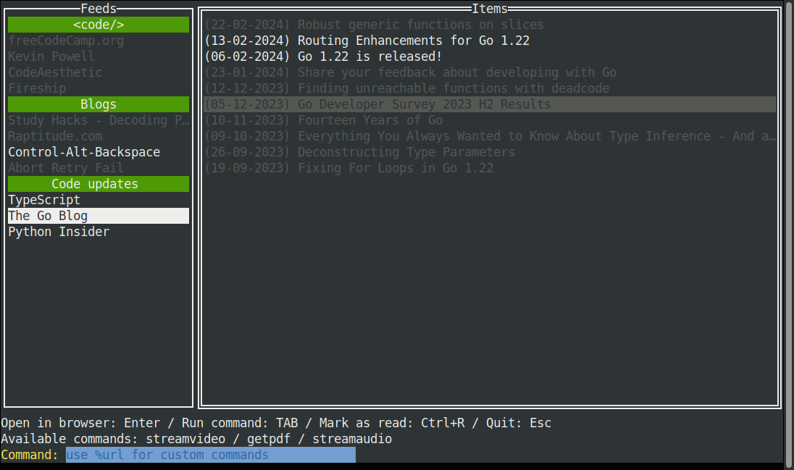

# RSSLauncher

A simple TUI RSS reader written in Go.



## Features

* Simple terminal user interface
* Organize your feeds by categories
* Import your feeds from a opml file
* Launch commands from the TUI
* Store old items on a local DB (sqlite3)
* Ignore items based on a list of blacklisted words

## Dependencies

* libx11-dev

## Options

|Options|Description|Parameter|
|-|-|-|
|-h, --help|show help|-|
|-af|add new feed|feed URL|
|-c|new feed category|category name|
|-cc|clear cache|-|
|-es|export settings|-|
|-iopml|import feeds from opml|opml path|

### Examples

```bash
rss # run RSSLauncher
rss -af mynewfeed.com/feed # add new feed to feed list
quotes -af mynewfeed.com/feed -c blogs # add new feed to blogs category 
```
